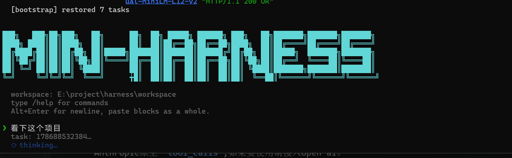

# MiniMax Harness



基于 **ReAct 模式** 的 Agent Harness 运行时 —— Python async 实现,LLM + 工具调用驱动通用智能体;内置 `coding` 技能作为演示用例(覆盖探索→规划→实现→验证工作流),支持多轮对话、技能渐进披露、人工审批、上下文压缩、反振荡看门狗与 SQLite 持久化。

> 一切由 [`Harness`](./harness.py) 顶层 façade 组装,默认入口 `python main.py` 启交互式 CLI。

---

## 状态

项目处于快速迭代阶段,**接口与数据结构可能变更**。适合研究与实验性集成,生产使用请自行评估稳定性。

---

## 特性

- **ReAct 主循环** —— 状态机 `IDLE → THINKING → PARSING → VALIDATING → ACTIVE → OBSERVING → APPROVAL_WAITING → FINISHED`;LLM 可输出 ReAct 文本协议或 OpenAI 原生 `tool_calls`,暂未兼容Anthropic原生 `tool_calls`,如果要使用请接入OpenAI。
- **技能渐进披露** —— 门控工具按技能阶段开放,LLM 必须先调 `activate_skill`。
- **人工审批闸门** —— `dangerous=True` 的工具执行前需用户确认,超时视为拒绝。
- **上下文压缩** —— `PRESERVE_ALL` / `WINDOW` / `TASK_AWARE` 三策略,自动修复 OpenAI tool 协议孤儿消息。
- **反振荡看门狗** —— 滑窗检测对同一 `(tool_name, args)` 哈希的连续调用,达阈值注入警告或终止任务。
- **SQLite 持久化** —— 任务状态/消息自动 checkpoint,重启自动恢复 RUNNING → PAUSED。
- **MCP 工具接入** —— 启动时 pool 连接,自动发现并注册。
- **sub-agent** —— 顶层 agent 可派生隔离子上下文。

---

## 运行

### 准备依赖

Python 3.13+,最小依赖集:

```bash
pip install pyyaml prompt_toolkit aiohttp
```

其余(LLM SDK、MCP 客户端)按实际模型/MCP 协议补齐。

### 配置

在运行目录放 `harness.yaml`(建议这样设置),或走环境变量。优先级:**文件 > 环境变量 > 内置默认**。

`harness.yaml`:

```yaml
paths:
  skills_dir: "./skills"
  mcp_server_script: "./tools/coding_tools_server.py"

llm:
  api_key: "${OPENAI_API_KEY}"
  base_url: "https://api.openai.com/v1"
  model: "gpt-4o-mini"
```

或纯环境变量(无需 YAML):

```bash
export OPENAI_API_KEY=sk-...
export OPENAI_BASE_URL=https://api.openai.com/v1
export AGENT_MODEL=gpt-4o-mini
export AGENT_SKILLS_DIR=./skills
export AGENT_MCP_SERVER=./tools/coding_tools_server.py
export AGENT_WORKSPACE=./workspace
```

```win cmd(仅对当前 CMD 窗口生效)
set OPENAI_API_KEY=sk-...
set OPENAI_BASE_URL=https://api.openai.com/v1
set AGENT_MODEL=gpt-4o-mini
set AGENT_SKILLS_DIR=./skills
set AGENT_MCP_SERVER=./tools/coding_tools_server.py
set AGENT_WORKSPACE=./workspace
```

```win PowerShell(仅对当前 PowerShell 窗口生效)
$env:OPENAI_API_KEY=sk-...
$env:OPENAI_BASE_URL=https://api.openai.com/v1
$env:AGENT_MODEL=gpt-4o-mini
$env:AGENT_SKILLS_DIR=./skills
$env:AGENT_MCP_SERVER=./tools/coding_tools_server.py
$env:AGENT_WORKSPACE=./workspace
```

> `AGENT_WORKSPACE` 为 agent 读写文件的根目录,子进程通过该 env 拿到绝对路径;未设置时回退到 `os.getcwd()`。
>
> 上下文窗口(`context_max_tokens` / `context_reserve_tokens`)只走环境变量,不进 `harness.yaml`;未设置时使用 `bootstrap.py` 内的硬编码值。

> `${VAR}` 形式的占位符在加载时插值。变量不存在 → stderr 警告并保留字面量;变量名非法 → 直接退出。

### 启动

```bash
python main.py                       # 交互式 CLI
python input_gateway.py              # InputGateway 意图识别独立冒烟测试
python tools/coding_tools_server.py  # 单独启动 MCP server(调试)
```

---

## CLI

| 命令 | 作用 |
| --- | --- |
| `/help` | 显示帮助 |
| `/tools` | 列出当前可见工具 |
| `/status` | 运行指标与任务状态 |
| `/cancel` | 取消当前任务(RUNNING 时也可用 Ctrl+C) |
| `/clear` | 清屏 + 重置当前任务记忆 |
| `/quit` | 退出 |

**多轮对话**:同任务继续输入即可。**危险操作审批**:`write_file` / `shell_exec` / `apply_patch` 执行前弹 `[APPROVAL]`,输入 `y` 通过;审批超时(`approval_timeout=300s`)视为拒绝。


## 待开发
1.上下文记忆，增加前缀/token 命中率
2.Pregel 动态图 任务编排，支持复杂工作流（正在开发）
3.提高任务执行速度

## 参与贡献


## 许可证

[MIT](./LICENSE)